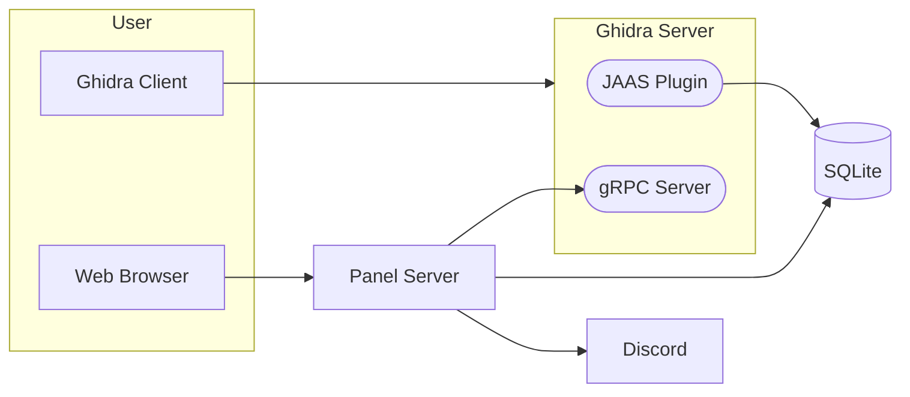

# Ghidra Community Panel

The Ghidra community panel assists with collaborative reverse engineering. It features:

- A self-service portal to allow users to create an account and request access to repositories
- A web interface for repository administrators to manage user access

This repository is not an official Ghidra project.


## Design

`ghidra-panel` introduces the following components:

- [SQLite database] storing hashed user credentials
- [JAAS plugin] implementing a Ghidra authentication provider
- [gRPC server] providing an API for the panel to interact with Ghidra
- Web server, written in [Go]
- Discord OAuth2 integration to authenticate users,
  and link Ghidra usernames to Discord usernames
  - Discord was chosen because all RE communities I've worked with use it
- Optional OpenID Connect login for other SSO providers (see [OIDC](#oidc))

[SQLite database]: https://www.sqlite.org/index.html
[JAAS plugin]: https://docs.oracle.com/javase/8/docs/technotes/guides/security/jaas/JAASRefGuide.html
[gRPC server]: https://grpc.io/
[Go]: https://go.dev/
[Discord OAuth2]: https://discord.com/developers/docs/topics/oauth2



## OIDC

In addition to Discord, users can sign in with any OpenID Connect provider.
OIDC is enabled by adding an `oidc` section with an `issuer` to the config file:

```json
{
  "oidc": {
    "issuer": "https://auth.example.com/application/o/ghidra/",
    "client_id": "$env:OIDC_CLIENT_ID",
    "client_secret": "$env:OIDC_CLIENT_SECRET",
    "display_name": "Example SSO",
    "super_admins": ["<sub of admin user>"]
  }
}
```

| Key              | Required | Default                        | Description                                                |
|------------------|----------|--------------------------------|------------------------------------------------------------|
| `issuer`         | yes      |                                | Issuer URL, used for discovery                             |
| `client_id`      | yes      |                                | OAuth2 client ID                                           |
| `client_secret`  | yes      |                                | OAuth2 client secret                                       |
| `display_name`   | no       | `SSO`                          | Login button label ("Continue with ...")                   |
| `scopes`         | no       | `["openid", "profile", "email"]` | Requested scopes                                         |
| `username_claim` | no       | `preferred_username`           | Userinfo claim used as the display/default Ghidra username |
| `super_admins`   | no       |                                | `sub` values of super admins                               |

Register `<base_url>/oidc/redirect` as the redirect URI with your provider.
Each OIDC subject is assigned a stable local user ID stored in the database.

To offer only OIDC login, leave `discord.client_id` and `discord.client_secret` unset.
In that case the login page is skipped and users are sent straight to the OIDC provider.
The Discord `webhook_url` still delivers access request notifications, and the optional
`bot_token` sets the webhook's name and avatar from your Discord application.

```json
{
  "discord": {
    "webhook_url": "$env:DISCORD_WEBHOOK_URL"
  },
  "oidc": { "...": "..." }
}
```

### Secrets from environment variables

Secret values can be loaded from the environment by prefixing the variable name with `$env:`,
e.g. `"client_secret": "$env:OIDC_CLIENT_SECRET"`. The panel refuses to start if the variable is unset.
This is supported for `discord.bot_token`, `discord.client_id`, `discord.client_secret`,
`discord.webhook_url`, `oidc.issuer`, `oidc.client_id` and `oidc.client_secret`.

## Philosophy

This software serves a hobbyist community with limited time.
As such, it aims to be simple, reproducible, and easy to maintain.

This rules out extensive use of external software, such as libraries,
database servers, auth servers, etc. Any such software would require
continuous updating.

This further means:
- No fancy IdP or access controls
  - [Keycloak](https://www.keycloak.org/) looked promising, but
    its JAAS adapter is [deprecated](https://www.keycloak.org/docs/22.0.1/securing_apps/#keycloak-java-adapters)
- A Go-based web server is a safe choice, as the standard library
  contains almost everything we need
- Web pages rendered server-side

## Acknowledgements

This panel currently powers [decomp.dev](https://decomp.dev), a shared space for GC/Wii decompilation projects.

Special thank you to the [mkw.re](https://github.com/mkw-re) contributors for creating the [original project](https://github.com/mkw-re/ghidra-panel).
